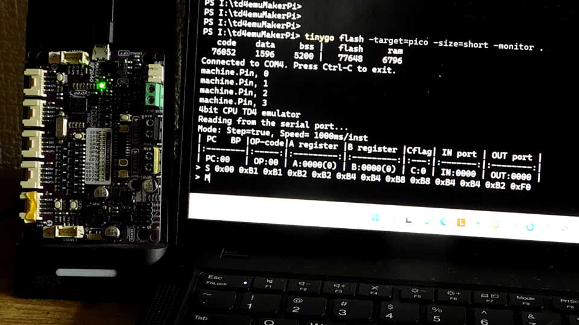
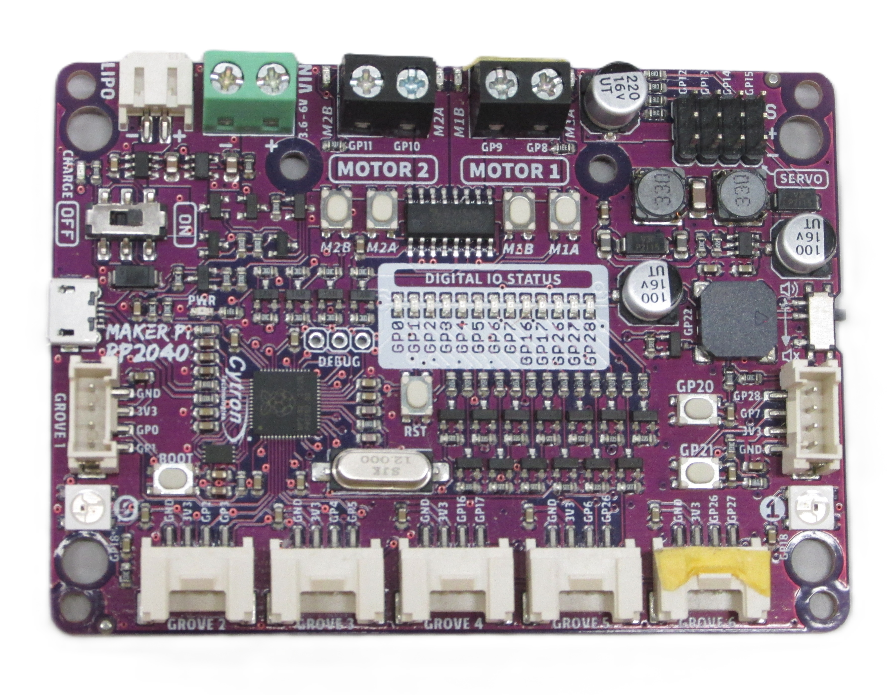

# TD4 エミュレータ for Maker Pi RP2040
<!-- pandoc -f markdown -t html5 -o README.html -c github.css README.md -->



## 1. 概要

Go言語で作成したtd4emuをtinygoで書き換え、Cytron Maker Pi RP2040用に移植したものです。  

[Maker Pi RP2040](https://www.cytron.io/p-maker-pi-rp2040-simplifying-robotics-with-raspberry-pi-rp2040)  
   

OSのコンソールで動いていたものを、シリアルターミナルで動くようにしただけなので、基本機能は一般のOS上で動くGo版のtd4emuと全く変わりません。  
Maker Pi RP2040 で動作確認を行い、機能拡張してこのボード上に搭載されているユーザボタンとLEDをIn命令とOut命令で制御できるようにしました。  

- In命令による入力2ビットを2個のユーザボタンに割り当てました。
- Out命令による出力4ビットを4個のLEDに割り当てました。

IN命令  

| bit |  3  |  2  |  1  |  0  |
|:---:|:---:|:---:|:---:|:---:|
| IN  |  -  |  -  |  SW |  SW |
| GPIO|  -  |  -  | GP21| GP20|

OUT命令  

| bit |  3  |  2  |  1  |  0  |
|:---:|:---:|:---:|:---:|:---:|
| out | LED | LED | LED | LED |
| GPIO| GP3 | GP2 | GP1 | GP0 |

## 2. コンパイルと実行プログラムの書込み方法

ソースコード[main.go](./main.go)があるディレクトリに移動して、以下のコマンドを実行して下さい。  

```bash
> tinygo flash -target=pico -size=short -monitor .
   code    data     bss |   flash     ram
  76052    1596    5200 |   77648    6796
Connected to COM4. Press Ctrl-C to exit.
machine.Pin, 0
machine.Pin, 1
machine.Pin, 2
machine.Pin, 3
4bit CPU TD4 emulator
Reading from the serial port...
Mode: Step=true, Speed= 1000ms/inst
| PC   BP |OP-code|A register |B register |Cflag| IN port | OUT port |
|:--------|:-----:|:---------:|:---------:|:---:|:-------:|:--------:|
| PC:00   | OP:00 | A:0000(0) | B:0000(0) | C:0 | IN:0000 | OUT:0000 |
>
```

## 3. 使用方法について

[../README.md](../README.md) の操作方法と基本コマンドの使い方をお読み下さい。

## 4. 拡張機能の使用方法について

2つサンプルを紹介し、使用方法を解説します。  

### LEDの点滅（ナイトライダー）

1. サンプルとして、4つのLEDを点滅させる以下のソースコードを使用します。

```bash
> type .\KnightRider.td4
; Sample 1: Knight Rider (Scanner)
; ナイトライダー :特殊装備を搭載したドリーム・カー『ナイト2000』のフロント部分の照明
; LEDが左から右へ、右から左へと流れるように点灯します。TD4にはシフト命令がないため、即値転送でアニメーションを作ります。
; 0001 -> 0010 -> 0100 -> 1000 -> 0100 -> 0010 -> Repeat

loop:
    OUT 1       ; ○○○● (0001) を出力
    OUT 1       ; ○○○● (0001) を出力
    OUT 2       ; ○○●○ (0010) を出力
    OUT 2       ; ○○●○ (0010) を出力
    OUT 4       ; ○●○○ (0100) を出力
    OUT 4       ; ○●○○ (0100) を出力
    OUT 8       ; ●○○○ (1000) を出力
    OUT 8       ; ●○○○ (1000) を出力
    OUT 4       ; ○●○○ (0100) を出力
    OUT 4       ; ○●○○ (0100) を出力
    OUT 2       ; ○○●○ (0010) を出力 - 折り返し
        JMP     loop    ; 先頭に戻る。
```

2. ソースコードを[td4asm](../../td4asm/README.md)でアセンブルします。最初に、アセンブルされたコードを確認し、次にHexファイルを出力しています。

```bash
> .\td4asm.exe -list .\KnightRider.td4

 ADDR      | BINARY    | HEX | SOURCE CODE
-----------|-----------|-----|----------------
 00 [0000] | 1011_0001 |  B1 | OUT 1
 01 [0001] | 1011_0001 |  B1 | OUT 1
 02 [0010] | 1011_0010 |  B2 | OUT 2
 03 [0011] | 1011_0010 |  B2 | OUT 2
 04 [0100] | 1011_0100 |  B4 | OUT 4
 05 [0101] | 1011_0100 |  B4 | OUT 4
 06 [0110] | 1011_1000 |  B8 | OUT 8
 07 [0111] | 1011_1000 |  B8 | OUT 8
 08 [1000] | 1011_0100 |  B4 | OUT 4
 09 [1001] | 1011_0100 |  B4 | OUT 4
 0A [1010] | 1011_0010 |  B2 | OUT 2
 0B [1011] | 1111_0000 |  F0 | JMP loop

Success! Generated 12 bytes.
> .\td4asm.exe -o .\KnightRider.hex .\KnightRider.td4
Output saved to '.\KnightRider.hex'
```

3. 生成されたHexファイルの中身を確認します。  

```bash
> cat .\KnightRider.hex
S 0x00 0xB1 0xB1 0xB2 0xB2 0xB4 0xB4 0xB8 0xB8 0xB4 0xB4 0xB2 0xF0
```

4. td4emuを起動します。

```bash
> tinygo flash -target=pico -size=short -monitor .
   code    data     bss |   flash     ram
  76052    1596    5200 |   77648    6796
Connected to COM4. Press Ctrl-C to exit.
machine.Pin, 0
machine.Pin, 1
machine.Pin, 2
machine.Pin, 3
4bit CPU TD4 emulator
Reading from the serial port...
Mode: Step=true, Speed= 1000ms/inst
| PC   BP |OP-code|A register |B register |Cflag| IN port | OUT port |
|:--------|:-----:|:---------:|:---------:|:---:|:-------:|:--------:|
| PC:00   | OP:00 | A:0000(0) | B:0000(0) | C:0 | IN:0000 | OUT:0000 |
```

5. 先程のHex形式のバイナリコードをtd4に書き込みます。  

```bash
> S 0x00 0xB1 0xB1 0xB2 0xB2 0xB4 0xB4 0xB8 0xB8 0xB4 0xB4 0xB2 0xF0
> M
| Adress | OP-code          |
|:------:|:----------------:|
|   00   | 0xB1 0b1011_0001 |
|   01   | 0xB1 0b1011_0001 |
|   02   | 0xB2 0b1011_0010 |
|   03   | 0xB2 0b1011_0010 |
|   04   | 0xB4 0b1011_0100 |
|   05   | 0xB4 0b1011_0100 |
|   06   | 0xB8 0b1011_1000 |
|   07   | 0xB8 0b1011_1000 |
|   08   | 0xB4 0b1011_0100 |
|   09   | 0xB4 0b1011_0100 |
|   10   | 0xB2 0b1011_0010 |
|   11   | 0xF0 0b1111_0000 |
|   12   | 0x00 0b0000_0000 |
|   13   | 0x00 0b0000_0000 |
|   14   | 0x00 0b0000_0000 |
|   15   | 0x00 0b0000_0000 |
```

6. T コマンドで、ステップ実行します。  
ここでは、48ステップ実行しています。  
4つLEDの点滅が左右に移動します。  

```bash
> T 48
| PC:01   | OP:B1 | A:0000(0) | B:0000(0) | C:0 | IN:0000 | OUT:0001 |
| PC:02   | OP:B2 | A:0000(0) | B:0000(0) | C:0 | IN:0000 | OUT:0001 |
| PC:03   | OP:B2 | A:0000(0) | B:0000(0) | C:0 | IN:0000 | OUT:0010 |
| PC:04   | OP:B4 | A:0000(0) | B:0000(0) | C:0 | IN:0000 | OUT:0010 |
| PC:05   | OP:B4 | A:0000(0) | B:0000(0) | C:0 | IN:0000 | OUT:0100 |
| PC:06   | OP:B8 | A:0000(0) | B:0000(0) | C:0 | IN:0000 | OUT:0100 |
| PC:07   | OP:B8 | A:0000(0) | B:0000(0) | C:0 | IN:0000 | OUT:1000 |
| PC:08   | OP:B4 | A:0000(0) | B:0000(0) | C:0 | IN:0000 | OUT:1000 |
| PC:09   | OP:B4 | A:0000(0) | B:0000(0) | C:0 | IN:0000 | OUT:0100 |
| PC:10   | OP:B2 | A:0000(0) | B:0000(0) | C:0 | IN:0000 | OUT:0100 |
| PC:11   | OP:F0 | A:0000(0) | B:0000(0) | C:0 | IN:0000 | OUT:0010 |
```

7. あまりにも遅いので、Vコマンドでクロックアップを行い、再度、T コマンドで、ステップ実行します。  
デフォルトでは、クロックを1Hzに設定してあるが、V コマンドで、100msを設定してクロックを10Hzに変更しています。
ステップ実行すると、4つのLEDが点滅しながら高速で左右に移動します。  

```bash
> V 100
Speed=  100ms/inst
> T 96
| PC:01   | OP:B1 | A:0000(0) | B:0000(0) | C:0 | IN:0000 | OUT:0001 |
| PC:02   | OP:B2 | A:0000(0) | B:0000(0) | C:0 | IN:0000 | OUT:0001 |
| PC:03   | OP:B2 | A:0000(0) | B:0000(0) | C:0 | IN:0000 | OUT:0010 |
| PC:04   | OP:B4 | A:0000(0) | B:0000(0) | C:0 | IN:0000 | OUT:0010 |
| PC:05   | OP:B4 | A:0000(0) | B:0000(0) | C:0 | IN:0000 | OUT:0100 |
| PC:06   | OP:B8 | A:0000(0) | B:0000(0) | C:0 | IN:0000 | OUT:0100 |
| PC:07   | OP:B8 | A:0000(0) | B:0000(0) | C:0 | IN:0000 | OUT:1000 |
| PC:08   | OP:B4 | A:0000(0) | B:0000(0) | C:0 | IN:0000 | OUT:1000 |
| PC:09   | OP:B4 | A:0000(0) | B:0000(0) | C:0 | IN:0000 | OUT:0100 |
| PC:10   | OP:B2 | A:0000(0) | B:0000(0) | C:0 | IN:0000 | OUT:0100 |
| PC:11   | OP:F0 | A:0000(0) | B:0000(0) | C:0 | IN:0000 | OUT:0010 |
| PC:00   | OP:B1 | A:0000(0) | B:0000(0) | C:0 | IN:0000 | OUT:0010 |
| PC:01   | OP:B1 | A:0000(0) | B:0000(0) | C:0 | IN:0000 | OUT:0001 |
| PC:02   | OP:B2 | A:0000(0) | B:0000(0) | C:0 | IN:0000 | OUT:0001 |
| PC:03   | OP:B2 | A:0000(0) | B:0000(0) | C:0 | IN:0000 | OUT:0010 |
| PC:04   | OP:B4 | A:0000(0) | B:0000(0) | C:0 | IN:0000 | OUT:0010 |

```

### 入力から出力へ

1. サンプルとして、入力ポートの内容をそのまま出力ポートに送る以下のソースコードを使用します。

```bash
> type .\InOut.td4
; Input -> Output Sample
; 入力ポートの内容をそのまま出力ポートに送ります。
LOOP:
    IN  B       ; 入力ポートの値をBレジスタに読み込む。
    OUT B       ; Bレジスタの値を出力ポートに送る。
    JMP LOOP    ; 先頭に戻り、処理を繰り返す。
```

2. ソースコードを[td4asm](../../td4asm/README.md)でアセンブルします。最初に、アセンブルされたコードを確認し、次にHexファイルを出力しています。

```bash
> .\td4asm.exe -list .\InOut.td4

 ADDR      | BINARY    | HEX | SOURCE CODE
-----------|-----------|-----|----------------
 00 [0000] | 0110_0000 |  60 | IN B
 01 [0001] | 1001_0000 |  90 | OUT B
 02 [0010] | 1111_0000 |  F0 | JMP LOOP

Success! Generated 3 bytes.
> .\td4asm.exe -o .\KnightRider.hex .\KnightRider.td4
Output saved to '.\KnightRider.hex'
```

3. 生成されたHexファイルの中身を確認します。  

```bash
> cat .\InOut.hex
S 0x00 0x60 0x90 0xF0
```

4. td4emuを起動します。

```bash
> tinygo flash -target=pico -size=short -monitor .
   code    data     bss |   flash     ram
  76052    1596    5200 |   77648    6796
Connected to COM4. Press Ctrl-C to exit.
machine.Pin, 0
machine.Pin, 1
machine.Pin, 2
machine.Pin, 3
4bit CPU TD4 emulator
Reading from the serial port...
Mode: Step=true, Speed= 1000ms/inst
| PC   BP |OP-code|A register |B register |Cflag| IN port | OUT port |
|:--------|:-----:|:---------:|:---------:|:---:|:-------:|:--------:|
| PC:00   | OP:00 | A:0000(0) | B:0000(0) | C:0 | IN:0000 | OUT:0000 |
```

5. 先程のHex形式のバイナリコードをtd4に書き込みます。  

```bash
> S 0x00 0x60 0x90 0xF0
> M
| Adress | OP-code          |
|:------:|:----------------:|
|   00   | 0x60 0b0110_0000 |
|   01   | 0x90 0b1001_0000 |
|   02   | 0xF0 0b1111_0000 |
|   03   | 0x00 0b0000_0000 |
|   04   | 0x00 0b0000_0000 |
|   05   | 0x00 0b0000_0000 |
|   06   | 0x00 0b0000_0000 |
|   07   | 0x00 0b0000_0000 |
|   08   | 0x00 0b0000_0000 |
|   09   | 0x00 0b0000_0000 |
|   10   | 0x00 0b0000_0000 |
|   11   | 0x00 0b0000_0000 |
|   12   | 0x00 0b0000_0000 |
|   13   | 0x00 0b0000_0000 |
|   14   | 0x00 0b0000_0000 |
|   15   | 0x00 0b0000_0000 |
```

6. このままでは遅いので、Vコマンドでクロックアップを行い、再度、T コマンドで、ステップ実行します。  
デフォルトでは、クロックを1Hzに設定してあるが、V コマンドで、100msを設定してクロックを10Hzに変更しています。

```bash
> V 100
Speed=  100ms/inst


7. T コマンドで、ステップ実行します。  

ここでは、100ステップ実行しています。  
GP20 と GP21に接続されているユーザボタンを押すと、それぞれに対応したLEDが点灯します。　　


```bash
> v 100
Speed=  100ms/inst
> T 100
| PC:00   | OP:60 | A:0000(0) | B:0000(0) | C:0 | IN:0000 | OUT:0000 |
| PC:01   | OP:90 | A:0000(0) | B:0000(0) | C:0 | IN:0000 | OUT:0000 |
| PC:02   | OP:F0 | A:0000(0) | B:0000(0) | C:0 | IN:0000 | OUT:0000 |
| PC:00   | OP:60 | A:0000(0) | B:0000(0) | C:0 | IN:0000 | OUT:0000 |
| PC:01   | OP:90 | A:0000(0) | B:0001(1) | C:0 | IN:0001 | OUT:0000 |
| PC:02   | OP:F0 | A:0000(0) | B:0001(1) | C:0 | IN:0001 | OUT:0001 |
| PC:00   | OP:60 | A:0000(0) | B:0001(1) | C:0 | IN:0001 | OUT:0001 |
| PC:01   | OP:90 | A:0000(0) | B:0001(1) | C:0 | IN:0001 | OUT:0001 |
| PC:02   | OP:F0 | A:0000(0) | B:0001(1) | C:0 | IN:0001 | OUT:0001 |
| PC:00   | OP:60 | A:0000(0) | B:0001(1) | C:0 | IN:0001 | OUT:0001 |
| PC:01   | OP:90 | A:0000(0) | B:0000(0) | C:0 | IN:0000 | OUT:0001 |
| PC:02   | OP:F0 | A:0000(0) | B:0000(0) | C:0 | IN:0000 | OUT:0000 |
| PC:00   | OP:60 | A:0000(0) | B:0000(0) | C:0 | IN:0000 | OUT:0000 |
| PC:01   | OP:90 | A:0000(0) | B:0010(2) | C:0 | IN:0010 | OUT:0000 |
| PC:02   | OP:F0 | A:0000(0) | B:0010(2) | C:0 | IN:0010 | OUT:0010 |
| PC:00   | OP:60 | A:0000(0) | B:0000(2) | C:0 | IN:0010 | OUT:0010 |
| PC:01   | OP:90 | A:0000(0) | B:0010(2) | C:0 | IN:0010 | OUT:0010 |
| PC:02   | OP:F0 | A:0000(0) | B:0010(2) | C:0 | IN:0010 | OUT:0010 |
| PC:00   | OP:60 | A:0000(0) | B:0010(2) | C:0 | IN:0010 | OUT:0010 |
| PC:01   | OP:90 | A:0000(0) | B:0000(0) | C:0 | IN:0000 | OUT:0010 |
| PC:02   | OP:F0 | A:0000(0) | B:0000(0) | C:0 | IN:0000 | OUT:0000 |
| PC:00   | OP:60 | A:0000(0) | B:0000(0) | C:0 | IN:0000 | OUT:0000 |
| PC:01   | OP:90 | A:0000(0) | B:0001(1) | C:0 | IN:0001 | OUT:0000 |
| PC:02   | OP:F0 | A:0000(0) | B:0001(1) | C:0 | IN:0001 | OUT:0001 |
| PC:00   | OP:60 | A:0000(0) | B:0001(1) | C:0 | IN:0001 | OUT:0001 |
| PC:01   | OP:90 | A:0000(0) | B:0001(1) | C:0 | IN:0001 | OUT:0001 |
| PC:02   | OP:F0 | A:0000(0) | B:0001(1) | C:0 | IN:0001 | OUT:0001 |
```

