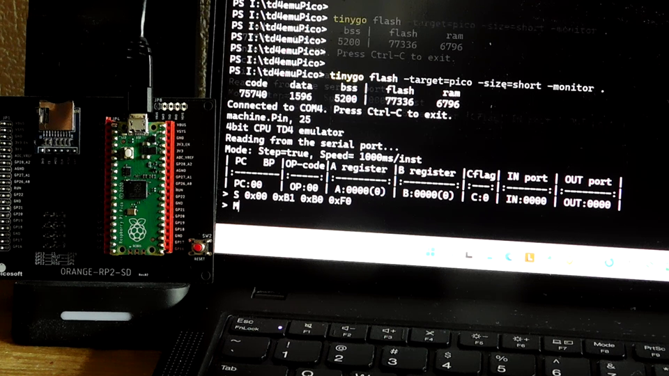

# TD4 エミュレータ for Raspberry Pi Pico
<!-- pandoc -f markdown -t html5 -o README.html -c github.css README.md -->



## 1. 概要

Go言語で作成したtd4emuをtinygoで書き換え、Raspberry Pi Pico用に移植したものです。  


OSのコンソールで動いていたものを、シリアルターミナルで動くようにしただけなので、基本機能は一般のOS上で動くGo版のtd4emuと全く変わりません。  
機能拡張を行い、Out命令による4bit出力の最下位ビットをRaspi picoのLEDに割当てました。これにより、LEDのOn、Off制御が可能です。  

| bit |  3  |  2  |  1  |  0  |
|:---:|:---:|:---:|:---:|:---:|
| out |  -  |  -  |  -  | LED |
| GPIO|  -  |  -  |  -  | GP25|

## 2. コンパイルと実行プログラムの書込み方法

ソースコード[main.go](./main.go)があるディレクトリに移動して、以下のコマンドを実行して下さい。  

```bash
> tinygo flash -target=pico -size=short -monitor .
   code    data     bss |   flash     ram
  75740    1596    5200 |   77336    6796
Connected to COM4. Press Ctrl-C to exit.
machine.Pin, 25
4bit CPU TD4 emulator
Reading from the serial port...
Mode: Step=true, Speed= 1000ms/inst
| PC   BP |OP-code|A register |B register |Cflag| IN port | OUT port |
|:--------|:-----:|:---------:|:---------:|:---:|:-------:|:--------:|
| PC:00   | OP:00 | A:0000(0) | B:0000(0) | C:0 | IN:0000 | OUT:0000 |
>
```

## 3. 使用方法について

[../README.md](../README.md) の操作方法と基本コマンドの使い方をお読み下さい。

## 4. 拡張機能の使用方法について

LEDを点滅させるサンプルを実行し、使用方法を解説します。  

### LEDの点滅

1. サンプルとして、LEDを点滅させる以下のソースコードを使用します。

```bash
> type .\3ByteBlink.td4
; LED点滅プログラム
; わずか3byteの命令でLチカができます。
START:
    OUT 1      ; LED全点灯
    OUT 0      ; 全消灯
    JMP START  ; 繰り返し
```

2. ソースコードを[td4asm](../../td4asm/README.md)でアセンブルします。最初に、アセンブルされたコードを確認し、次にHexファイルを出力しています。


```bash
> .\td4asm.exe -list .\3ByteBlink.td4

 ADDR      | BINARY    | HEX | SOURCE CODE
-----------|-----------|-----|----------------
 00 [0000] | 1011_0001 |  B1 | OUT 1
 01 [0001] | 1011_0000 |  B0 | OUT 0
 02 [0010] | 1111_0000 |  F0 | JMP START

Success! Generated 3 bytes.

> .\td4asm.exe -o .\3ByteBlink.hex .\3ByteBlink.td4
Output saved to '.\3ByteBlink.hex'
```

3. 生成されたHexファイルの中身を確認します。  

```bash
> cat .\3ByteBlink.hex
S 0x00 0xB1 0xB0 0xF0
```

4. td4を起動します。

```bash
> tinygo flash -target=pico -size=short -monitor .
   code    data     bss |   flash     ram
  75740    1596    5200 |   77336    6796
Connected to COM4. Press Ctrl-C to exit.
machine.Pin, 25
4bit CPU TD4 emulator
Reading from the serial port...
Mode: Step=true, Speed= 1000ms/inst
| PC   BP |OP-code|A register |B register |Cflag| IN port | OUT port |
|:--------|:-----:|:---------:|:---------:|:---:|:-------:|:--------:|
| PC:00   | OP:00 | A:0000(0) | B:0000(0) | C:0 | IN:0000 | OUT:0000 |
```

5. 先程のHex形式のバイナリコードをtd4に書き込みます。  

```bash
> S 0x00 0xB1 0xB0 0xF0
>
```

6. T コマンドで、ステップ実行します。
ここでは、15ステップ実行し、LEDを5回点滅させます。

```bash
> T 15
| PC:01   | OP:B0 | A:0000(0) | B:0000(0) | C:0 | IN:0000 | OUT:0001 |
| PC:02   | OP:F0 | A:0000(0) | B:0000(0) | C:0 | IN:0000 | OUT:0000 |
| PC:00   | OP:B1 | A:0000(0) | B:0000(0) | C:0 | IN:0000 | OUT:0000 |
| PC:01   | OP:B0 | A:0000(0) | B:0000(0) | C:0 | IN:0000 | OUT:0001 |
| PC:02   | OP:F0 | A:0000(0) | B:0000(0) | C:0 | IN:0000 | OUT:0000 |
| PC:00   | OP:B1 | A:0000(0) | B:0000(0) | C:0 | IN:0000 | OUT:0000 |
| PC:01   | OP:B0 | A:0000(0) | B:0000(0) | C:0 | IN:0000 | OUT:0001 |
| PC:02   | OP:F0 | A:0000(0) | B:0000(0) | C:0 | IN:0000 | OUT:0000 |
| PC:00   | OP:B1 | A:0000(0) | B:0000(0) | C:0 | IN:0000 | OUT:0000 |
| PC:01   | OP:B0 | A:0000(0) | B:0000(0) | C:0 | IN:0000 | OUT:0001 |
| PC:02   | OP:F0 | A:0000(0) | B:0000(0) | C:0 | IN:0000 | OUT:0000 |
| PC:00   | OP:B1 | A:0000(0) | B:0000(0) | C:0 | IN:0000 | OUT:0000 |
| PC:01   | OP:B0 | A:0000(0) | B:0000(0) | C:0 | IN:0000 | OUT:0001 |
| PC:02   | OP:F0 | A:0000(0) | B:0000(0) | C:0 | IN:0000 | OUT:0000 |
| PC:00   | OP:B1 | A:0000(0) | B:0000(0) | C:0 | IN:0000 | OUT:0000 |
>
```

-------------------------------------------------

1. サンプルとして、入力結果をそのまま出力する以下のソースコードを使用します。

```bash
> type . InOut.td4
; Input -> Output Sample
; 入力ポートの内容をそのまま出力ポートに送ります。
LOOP:
    MOV B, 0    ; Bレジスタに0を代入して初期化する。
    IN  B       ; 入力ポートの値をBレジスタに読み込む。
    OUT B       ; Bレジスタの値を出力ポートに送る。
    JMP LOOP    ; 先頭に戻り、処理を繰り返す。
```

2. ソースコードを[td4asm](../../td4asm/README.md)でアセンブルします。最初に、アセンブルされたコードを確認し、次にHexファイルを出力しています。

```bash
>  .\td4asm.exe -list .\InOut.td4

 ADDR      | BINARY    | HEX | SOURCE CODE
-----------|-----------|-----|----------------
 00 [0000] | 0111_0000 |  70 | MOV B, 0
 01 [0001] | 0110_0000 |  60 | IN B
 02 [0010] | 1001_0000 |  90 | OUT B
 03 [0011] | 1111_0000 |  F0 | JMP LOOP

Success! Generated 4 bytes.
> .\td4asm.exe -o .\InOut.hex .\InOut.td4
Output saved to '.\InOut.hex'
```

3. 生成されたHexファイルの中身を確認します。  

```bash
> cat .\InOut.hex
S 0x00 0xB1 0xB0 0xF0
```

4. td4emuを起動します。

```bash
> tinygo flash -target=pico -size=short -monitor .
   code    data     bss |   flash     ram
  76052    1596    5200 |   77648    6796
Connected to COM4. Press Ctrl-C to exit.
machine.Pin, 0
machine.Pin, 1
machine.Pin, 2
machine.Pin, 3
4bit CPU TD4 emulator
Reading from the serial port...
Mode: Step=true, Speed= 1000ms/inst
| PC   BP |OP-code|A register |B register |Cflag| IN port | OUT port |
|:--------|:-----:|:---------:|:---------:|:---:|:-------:|:--------:|
| PC:00   | OP:00 | A:0000(0) | B:0000(0) | C:0 | IN:0000 | OUT:0000 |
```


5. 先程のHex形式のバイナリコードをtd4に書き込みます。  

```bash
> S 0x00 0xB1 0xB0 0xF0
> M
| Adress | OP-code          |
|:------:|:----------------:|
|   00   | 0xB1 0b1011_0001 |
|   01   | 0xB0 0b1011_0000 |
|   02   | 0xF0 0b1111_0000 |
|   03   | 0x00 0b0000_0000 |
|   04   | 0x00 0b0000_0000 |
|   05   | 0x00 0b0000_0000 |
|   06   | 0x00 0b0000_0000 |
|   07   | 0x00 0b0000_0000 |
|   08   | 0x00 0b0000_0000 |
|   09   | 0x00 0b0000_0000 |
|   10   | 0x00 0b0000_0000 |
|   11   | 0x00 0b0000_0000 |
|   12   | 0x00 0b0000_0000 |
|   13   | 0x00 0b0000_0000 |
|   14   | 0x00 0b0000_0000 |
|   15   | 0x00 0b0000_0000 |
```


6. T コマンドで、ステップ実行します。  
ここでは、30ステップ実行しています。  
4つLEDの点滅が左右に移動していきます。  

```bash
> T 30
| PC:01   | OP:90 | A:0000(0) | B:0000(0) | C:0 | IN:0000 | OUT:0000 |
| PC:02   | OP:F0 | A:0000(0) | B:0000(0) | C:0 | IN:0000 | OUT:0000 |
| PC:00   | OP:60 | A:0000(0) | B:0000(0) | C:0 | IN:0000 | OUT:0000 |
| PC:01   | OP:90 | A:0000(0) | B:0000(0) | C:0 | IN:0000 | OUT:0000 |
| PC:02   | OP:F0 | A:0000(0) | B:0000(0) | C:0 | IN:0000 | OUT:0000 |
| PC:00   | OP:60 | A:0000(0) | B:0000(0) | C:0 | IN:0000 | OUT:0000 |
| PC:01   | OP:90 | A:0000(0) | B:0010(2) | C:0 | IN:0010 | OUT:0000 |
| PC:02   | OP:F0 | A:0000(0) | B:0010(2) | C:0 | IN:0010 | OUT:0010 |
| PC:00   | OP:60 | A:0000(0) | B:0010(2) | C:0 | IN:0010 | OUT:0010 |
| PC:01   | OP:90 | A:0000(0) | B:0001(1) | C:0 | IN:0001 | OUT:0010 |
| PC:02   | OP:F0 | A:0000(0) | B:0001(1) | C:0 | IN:0001 | OUT:0001 |
| PC:00   | OP:60 | A:0000(0) | B:0001(1) | C:0 | IN:0001 | OUT:0001 |
| PC:01   | OP:90 | A:0000(0) | B:0001(1) | C:0 | IN:0001 | OUT:0001 |
| PC:02   | OP:F0 | A:0000(0) | B:0001(1) | C:0 | IN:0001 | OUT:0001 |
| PC:00   | OP:60 | A:0000(0) | B:0001(1) | C:0 | IN:0001 | OUT:0001 |
| PC:01   | OP:90 | A:0000(0) | B:0001(1) | C:0 | IN:0001 | OUT:0001 |
| PC:02   | OP:F0 | A:0000(0) | B:0001(1) | C:0 | IN:0001 | OUT:0001 |
| PC:00   | OP:60 | A:0000(0) | B:0001(1) | C:0 | IN:0001 | OUT:0001 |
| PC:01   | OP:00 | A:0000(0) | B:0000(0) | C:0 | IN:0000 | OUT:0001 |
| PC:02   | OP:F0 | A:0000(0) | B:0000(0) | C:0 | IN:0000 | OUT:0000 |
| PC:00   | OP:60 | A:0000(0) | B:0000(0) | C:0 | IN:0000 | OUT:0000 |
| PC:01   | OP:90 | A:0000(0) | B:0010(2) | C:0 | IN:0010 | OUT:0000 |
| PC:02   | OP:F0 | A:0000(0) | B:0010(2) | C:0 | IN:0010 | OUT:0010 |
| PC:00   | OP:60 | A:0000(0) | B:0010(2) | C:0 | IN:0010 | OUT:0010 |
| PC:01   | OP:90 | A:0000(0) | B:0000(0) | C:0 | IN:0000 | OUT:0010 |
| PC:02   | OP:F0 | A:0000(0) | B:0000(0) | C:0 | IN:0000 | OUT:0000 |
| PC:00   | OP:60 | A:0000(0) | B:0000(0) | C:0 | IN:0000 | OUT:0000 |
| PC:01   | OP:90 | A:0000(0) | B:0001(1) | C:0 | IN:0001 | OUT:0000 |
| PC:02   | OP:F0 | A:0000(0) | B:0001(1) | C:0 | IN:0001 | OUT:0001 |
| PC:00   | OP:60 | A:0000(0) | B:0001(1) | C:0 | IN:0001 | OUT:0001 |
>
```